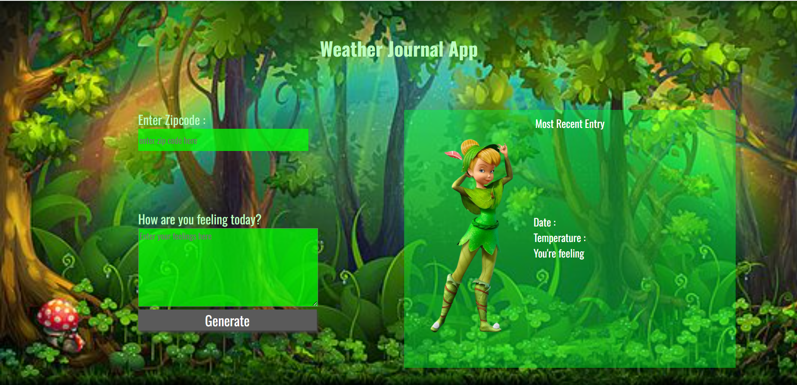

# Weather Journal App

## Project 3 - Weather Journal App (Front End Developer Udacity Nanodegree)
#### Technology used: HTML, CSS, Javascript (Vanilla)

# Weather Journal App

## Project Objective
Create a web app that uses the OpenWeatherMap API to get weather based on the user's location and dynamically update the UI.

## Setup

1. **Install Node and Packages:**
    npm install express cors body-parser
   

2. **Start the Server:**
    node server.js
 

## Development Strategy

1. **Set Up Server:**
    - Create `server.js` with Express, CORS, and Body-Parser.
    - Add GET and POST routes to handle data.

2. **Acquire API Key:**
    - Get API credentials from OpenWeatherMap.

3. **Fetch Weather Data:**
    - Write async functions in `website/app.js` to get weather data and update the server.

4. **Update UI:**
    - Use fetched data to dynamically update the HTML elements.

